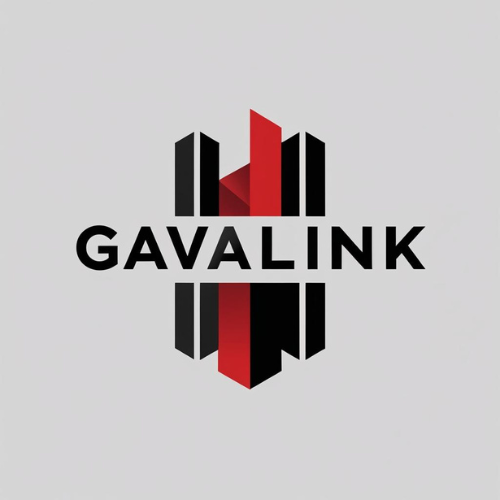

# GavaLink - KRA Citizen-Government Service Platform

A dual-portal web application serving as a secure bridge between Kenyan citizens (Wananchi) and Kenya Revenue Authority (KRA) officers, featuring an integrated ElevenLabs voice AI assistant.



## 🌟 Overview

GavaLink streamlines tax-related interactions between citizens and government officers through:
- **Citizen Dashboard**: View tax status, file returns, manage documents, and access voice AI assistance
- **Officer Dashboard**: Manage taxpayer cases, verify documents, send broadcasts, and view analytics
- **Voice AI Assistant**: ElevenLabs-powered conversational AI for guided tax assistance

## 🎨 Design System

The application uses the official **KRA color palette**:
- **Black** (`#1a1a1a`) - Primary elements, headers, authoritative UI
- **White** (`#ffffff`) - Backgrounds, content areas
- **Red** (`#BB0000`) - Alerts, warnings, important actions

## 🏗️ Tech Stack

| Category | Technology |
|----------|------------|
| Frontend | React 18, TypeScript, Vite |
| Styling | Tailwind CSS, shadcn/ui |
| State Management | TanStack React Query |
| Routing | React Router DOM v6 |
| Backend | Lovable Cloud (Supabase) |
| Voice AI | ElevenLabs Conversational AI |
| Charts | Recharts |
| Forms | React Hook Form, Zod |

## 📁 Project Structure

```
src/
├── assets/                 # Static assets (logos, images)
├── components/
│   ├── ui/                 # shadcn/ui components
│   ├── ActiveCallScreen.tsx
│   ├── CallHeader.tsx
│   ├── ConversationView.tsx
│   ├── FloatingCallIndicator.tsx
│   ├── MessageBubble.tsx
│   ├── NavLink.tsx
│   ├── QuickActions.tsx
│   ├── SpeakingIndicator.tsx
│   ├── VoiceControls.tsx
│   ├── VoiceWave.tsx
│   ├── VoiceWidgetController.tsx
│   └── WelcomeScreen.tsx
├── contexts/
│   └── CallContext.tsx     # Global call state management
├── hooks/
│   ├── use-mobile.tsx
│   └── use-toast.ts
├── integrations/
│   └── supabase/           # Supabase client & types
├── lib/
│   └── utils.ts            # Utility functions
├── pages/
│   ├── Index.tsx           # Landing/Home
│   ├── Login.tsx           # Authentication
│   ├── CitizenDashboard.tsx
│   ├── OfficerDashboard.tsx
│   ├── CallSimulator.tsx   # Voice AI interface
│   ├── Returns.tsx         # Tax returns filing
│   ├── Payments.tsx        # Payment management
│   ├── Documents.tsx       # Document uploads
│   ├── Applications.tsx    # Application tracking
│   ├── Support.tsx         # Support tickets
│   ├── BulkPINVerifier.tsx # Officer tool
│   ├── DocumentStamp.tsx   # Officer tool
│   ├── BroadcastUpdate.tsx # Officer tool
│   ├── Analytics.tsx       # Officer analytics
│   └── NotFound.tsx
├── App.tsx                 # Main app with routing
├── main.tsx                # Entry point
└── index.css               # Global styles & design tokens
```

## 🚀 Features

### Citizen Portal (`/citizen`)

| Feature | Description |
|---------|-------------|
| Dashboard Overview | KRA PIN status, compliance score, tax summary |
| Tax Returns | File NIL returns, view filing history |
| Payments | View obligations, make M-Pesa payments |
| Documents | Upload/manage tax documents |
| Applications | Track TCC and other applications |
| Support | Submit tickets, contact officers |
| Voice AI | ElevenLabs assistant for guided help |

### Officer Portal (`/officer`)

| Feature | Route | Description |
|---------|-------|-------------|
| Case Queue | `/officer` | Manage taxpayer cases with search/filter |
| Bulk PIN Verifier | `/officer/bulk-pin` | Verify multiple KRA PINs at once |
| Document Stamp | `/officer/document-stamp` | Apply official stamps to documents |
| Broadcast Update | `/officer/broadcast` | Send SMS/email to taxpayer groups |
| Analytics | `/officer/analytics` | Case volume, resolution time, categories |

### Voice AI Integration

The ElevenLabs voice widget is configured to appear only on citizen-facing pages:
- Login page (`/`)
- Citizen Dashboard (`/citizen`)

Officers do not see the voice widget as they assist users rather than file returns.

## 🗄️ Database Schema

### Tables

| Table | Purpose |
|-------|---------|
| `profiles` | User profile data (KRA PIN, contact info, compliance score) |
| `applications` | TCC and service applications |
| `documents` | Uploaded document metadata |
| `messages` | Officer-citizen communications |
| `tax_returns` | Tax filing records |
| `payments` | Payment transactions |
| `activity_log` | Audit trail |

### Row Level Security (RLS)

All tables have RLS policies ensuring users can only access their own data.

## 🔧 Environment Variables

```env
VITE_SUPABASE_URL=<supabase-project-url>
VITE_SUPABASE_PUBLISHABLE_KEY=<supabase-anon-key>
VITE_SUPABASE_PROJECT_ID=<project-id>
```

## 📱 Responsive Design

- **Mobile-first** approach with tablet and desktop adaptations
- **Touch targets**: Minimum 44px for accessibility
- **Breakpoints**: `sm: 640px`, `md: 768px`, `lg: 1024px`, `xl: 1280px`

## ♿ Accessibility

- WCAG 2.1 AA compliance target
- High contrast mode support (4.5:1 minimum ratio)
- Screen reader support with ARIA labels
- Keyboard navigation with visible focus indicators
- Voice AI serves as accessibility feature for visually impaired users

## 🚀 Getting Started

### Prerequisites

- Node.js 18+
- npm or bun

### Installation

```bash
# Clone the repository
git clone https://github.com/therza01/gavalink.git

# Navigate to project directory
cd gavalink

# Install dependencies
npm install

# Start development server
npm run dev
```

### Build for Production

```bash
npm run build
```

## 📊 Performance Targets

| Metric | Target |
|--------|--------|
| Page Load (3G) | < 3 seconds |
| Time to First NIL Return | < 5 minutes |
| Bundle Size | < 150kb gzipped |
| Network Support | Graceful degradation on 2G |

## 🌐 Browser Support

- Chrome (latest)
- Safari (latest)
- Samsung Internet
- Edge (latest)

## 🔐 Security

- Row Level Security (RLS) on all database tables
- Input validation with Zod schemas
- Secure authentication via Supabase Auth
- HTTPS-only connections

## 📄 License

Proprietary - Kenya Revenue Authority

## 🤝 Contributing

This is a government project. Contact the development team for contribution guidelines.
